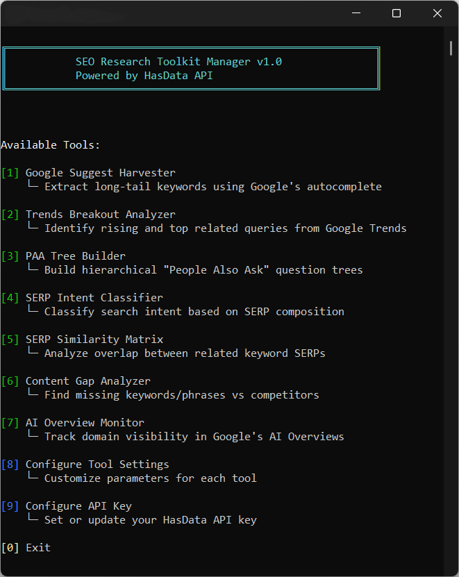

# SEO Research Toolkit

 

[](https://hasdata.com/)

Seven Python tools for SEO research, powered by the HasData API. They cover keyword research, competitive analysis, SERP intelligence, and content gap analysis at scale.

## Table of Contents

- [SEO Research Toolkit](#seo-research-toolkit)
- [Features](#features)
  - [Google Suggest Harvester](#1-google-suggest-harvester)
  - [Trends Breakout Analyzer](#2-trends-breakout-analyzer)
  - [PAA Tree Builder](#3-paa-tree-builder)
  - [SERP Intent Classifier](#4-serp-intent-classifier)
  - [SERP Similarity Matrix](#5-serp-similarity-matrix)
  - [Content Gap Analyzer](#6-content-gap-analyzer)
  - [AI Overview Monitor](#7-ai-overview-monitor)
- [Installation](#-installation)
- [Usage](#usage)
- [Configuration](#-configuration)
- [Output Examples](#output-examples)
- [Troubleshooting](#-troubleshooting)
- [Advanced Workflows](#-advanced-workflows)
- [Acknowledgments](#acknowledgments)
- [Support](#support)


## Features



Each tool runs on its own or through the manager menu.

### 1. **Google Suggest Harvester**
Extract thousands of long-tail keyword variations using Google's autocomplete API.
- **Use Case**: Discover untapped keyword opportunities
- **Method**: Recursive alphabetical expansion (depth configurable)
- **Output**: CSV file with unique suggestions
- **Speed**: Concurrent processing with configurable workers

### 2. **Trends Breakout Analyzer**
Identify rising search trends and high-volume queries before competitors.
- **Use Case**: Spot emerging topics and seasonal opportunities
- **Data Source**: Google Trends API
- **Output**: Rising queries (growth rate) + Top queries (volume)
- **Metrics**: Growth indicators and search index values

### 3. **PAA Tree Builder**
Build hierarchical question trees from "People Also Ask" boxes.
- **Use Case**: Map topic authority and content cluster opportunities
- **Method**: Recursive question discovery
- **Output**: Nested topic structure
- **Depth**: Configurable recursion levels

### 4. **SERP Intent Classifier**
Automatically classify search intent by analyzing SERP composition.
- **Use Case**: Understand what type of content ranks
- **Analysis**: URL pattern recognition (blog, product, forum, video, etc.)
- **Output**: Strategic content recommendations
- **Metrics**: SERP composition breakdown by content type

### 5. **SERP Similarity Matrix**
Measure keyword cannibalization and SERP overlap using Jaccard Index.
- **Use Case**: Identify clustering opportunities and keyword conflicts
- **Method**: URL set intersection analysis
- **Output**: Interactive heatmap + common URL frequency table
- **Visualization**: Seaborn-powered similarity matrix

### 6. **Content Gap Analyzer**
Find missing keywords and phrases compared to ranking competitors.
- **Use Case**: Optimize existing content for better rankings
- **Method**: N-gram frequency analysis (1, 2, and 3-grams)
- **Data Source**: Trafilatura-based content extraction
- **Output**: Gap report with competitor coverage metrics

### 7. **AI Overview Monitor**
Track domain visibility in Google's AI-generated search summaries.
- **Use Case**: Monitor brand presence in AI-powered search
- **Tracking**: Citation index and URL detection
- **Output**: Coverage report with share-of-voice metrics
- **Metrics**: AI trigger rate and citation frequency

---

## 📦 Installation

The setup is a clone, a pip install, and an API key.

### Prerequisites
- Python 3.11 or higher
- HasData API key ([Get one here](https://hasdata.com))

### Setup

1. **Clone the repository**
```bash
git clone https://github.com/yourusername/seo-research-toolkit.git
cd seo-research-toolkit
```

2. **Install dependencies**
```bash
pip install -r requirements.txt
```

3. **Configure API key** (choose one method):

**Option A: Environment variable**
```bash
export HASDATA_API_KEY="your_api_key_here"
```

**Option B: Configuration file**
```bash
echo "your_api_key_here" > .hasdata_config
```

**Option C: Interactive setup**
```bash
python seo_manager.py
# Select option [8] to configure
```

The key is stored once and reused by every tool.

## Usage

Configure before the first run.

> ⚠️ **IMPORTANT: CONFIGURATION REQUIRED BEFORE USE**
>
> All tools in this toolkit are managed via the **central script** `seo_manager.py`.
>
> If you run a tool **without configuring it first**, the manager will silently use
> **default placeholder values**, which are **unlikely to match your real intent**.
>
> To avoid misleading results, you should always configure:
>
> - **[8] Configure Tool Settings** - keywords, domains, geo, depth, limits, etc. for each tool
> - **[9] Configure API Key** - your HasData API key
>
> ⚠️ **No validation error is thrown when defaults are used.**
> Always review and set your parameters before running any tool.


### Interactive Mode (Recommended)

The menu covers running and configuring every tool.

```bash
python seo_manager.py
```

This launches a menu-driven interface where you can select and run any tool.

### Direct Tool Execution

The manager also takes the tool number as an argument.

```bash
# Run specific tool by number
python seo_manager.py 1  # Google Suggest Harvester
python seo_manager.py 2  # Trends Analyzer
# ... etc
```

Numbers follow the menu order.

### Individual Scripts
Each tool can also be run independently:
```bash
python google_suggest_harvester.py
python trends_breakout_analyzer.py
python paa_tree_builder.py
python serp_intent_classifier.py
python serp_similarity_matrix.py
python content_gap_analyzer.py
python ai_overview_monitor.py
```

Outputs land next to the scripts as CSV or JSON.

---

## ⚙️ Configuration

Settings live in the scripts and in the manager menu.

### Tool-Specific Settings

Each tool keeps its parameters in a block at the top of the script.

**Google Suggest Harvester**
```python
BASE_KEYWORD = "coffee"
MAX_DEPTH = 2  # 1 = a-z, 2 = aa-zz
MAX_WORKERS = 15  # Concurrent requests (check your plan limits)
```

**Trends Breakout Analyzer**
```python
SEED_TOPIC = "Coffee"
date = "now 7-d"  # Time range: now 1-d, now 7-d, today 12-m, etc.
geo = "US"  # Country code
```

**PAA Tree Builder**
```python
ROOT_KEYWORD = "coffee"
MAX_DEPTH = 2  # Recursion levels
```

**SERP Intent Classifier**
```python
KEYWORD = "instant coffee"
deviceType = "desktop"  # or "mobile"
```

**SERP Similarity Matrix**
```python
KEYWORDS = ["keyword1", "keyword2", ...]  # List of related terms
```

**Content Gap Analyzer**
```python
TARGET_KEYWORD = "health benefits of decaf coffee"
MY_URL = "https://example.com/your-article"
TOP_N_COMPETITORS = 10
```

**AI Overview Monitor**
```python
TARGET_DOMAIN = "webmd.com"
KEYWORDS = ["keyword1", "keyword2", ...]
```

---

## Output Examples

What a finished run prints, tool by tool.

### Google Suggest Harvester

The harvester reports speed and yield.

```
Finished in 45.23 seconds. Average Speed: 12.34 req/s
Done. Collected 1847 unique keywords.
Saved to long_tail_keywords_hasdata.csv
```

Around twelve requests a second is normal on the default settings.

### Trends Breakout Analyzer

Rising queries arrive sorted by growth.

```
--- Rising Queries (The Opportunity) ---
[Growth: Breakout] mushroom coffee benefits
[Growth: +450%] decaf coffee health
...
```

Breakout marks growth past the 5000% mark.

### PAA Tree Builder

The tree nests questions by depth.

```
- coffee
    - What are the health benefits of coffee?
        - Is coffee good for your heart?
        - Does coffee help with weight loss?
```

Depth is configurable per run.

### SERP Intent Classifier

The verdict names the dominant format and the move.

```
Dominant Type: Informational (Blog) (60.0%)
Action: Create a long-form Guide or Blog Post.
```

More output examples in our article: [Python for SEO](https://hasdata.com/blog/python-for-seo)

---

## Troubleshooting

The failures below account for most first runs.

### Common Issues

**"No trend data found"**
- Topic may be too niche or misspelled
- Try broader keywords or different geo-targeting

**"AI Overview not triggered"**
- AI Overviews are region-specific (US has highest coverage)
- Try the other device type, desktop against mobile

**Content extraction returns empty text**
- Enable JS rendering: `jsRendering: True`

---

## Advanced Workflows

The tools chain into three research routes.

### New Topic Research

From a rising topic to a content plan.

```
1. Trends Breakout Analyzer → Find rising topics
2. Google Suggest Harvester → Extract long-tail variations
3. PAA Tree Builder → Map content structure
4. SERP Intent Classifier → Determine content type
```

The harvester output feeds straight into step three.

### Content Optimization

From a keyword set to the gaps in a page.

```
1. SERP Similarity Matrix → Group related keywords
2. Content Gap Analyzer → Identify missing topics
3. AI Overview Monitor → Track visibility changes
```

The monitor closes the loop after publication.

### Competitive Intelligence

From a competitor SERP to a positioning angle.

```
1. SERP Intent Classifier → Analyze competitor strategies
2. Content Gap Analyzer → Reverse-engineer top pages
3. SERP Similarity Matrix → Find unique positioning opportunities
```

Each route reads the previous step's output files, no glue code needed.

---

## The AI-Script Study

`studies/ai-script-outcomes/` holds the measurement behind the article's warning about copy-pasting AI-generated SEO scripts. The script Google's AI Overview serves for "python script for seo" ran unchanged against 200 live domains from the Tranco list (`ZJQ6G`, taken 2026-09-02). It produced usable data on 108 of them, 84 refused outright, and 8 returned HTTP 200 with the audit reporting missing tags the rendered page actually carries. Rerouting the failed domains through a rendering API recovered 66 of the blocks, and 12 still audited the wrong fields. The JSON carries every per-domain row.

## Acknowledgments

- **HasData API** for providing reliable SERP and proxy infrastructure
- **Trafilatura** for content extraction
- **scikit-learn** for NLP capabilities

---

## Support

- **Documentation**: [HasData API Docs](https://docs.hasdata.com)
- **Full Article**: [Python for SEO](https://hasdata.com/blog/python-for-seo)

---

**Made with ☕ by SEO Professionals, for SEO Professionals**
